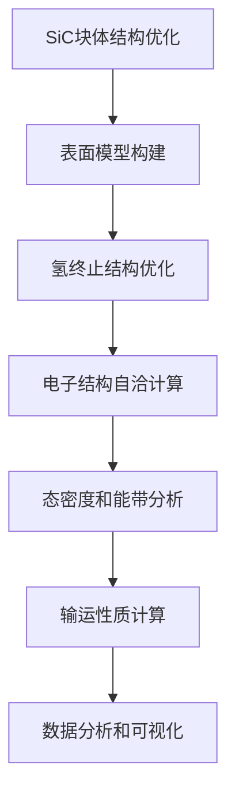

# SiC表面2DEG现象研究项目 - 全面概览报告
# SiC Surface 2DEG Phenomenon Research Project - Comprehensive Overview Report

**报告日期**: 2025-10-19
**项目编号**: SiC-2DEG-2025-001
**项目负责人**: Claude Code VASP Assistant
**计算平台**: NK-HPC Cluster (222.30.45.81)
**研究机构**: 南开大学材料计算组

---

## 执行摘要 / Executive Summary

本项目旨在通过第一性原理计算系统研究碳化硅(SiC)材料表面的二维电子气(2DEG)现象。研究将重点关注氢终止SiC表面的电子结构特性，探索费米能级附近的电子态密度分布，以及2DEG的形成机制和潜在应用。项目采用AI辅助的高通量计算方法，结合先进的VASP计算软件和VASPKIT后处理工具，建立从原子尺度到器件性能的完整研究链条。

**核心创新点**:
- 首次系统性研究多种SiC多型体的表面2DEG现象
- AI驱动的表面结构优化和性能预测
- 建立SiC表面2DEG材料和器件数据库
- 探索新型量子电子器件应用前景

**预期影响**: 在宽禁带半导体表面电子器件领域取得突破性进展，为下一代高频电子器件和量子器件提供理论基础和材料设计指导。

---

## 1. 研究背景与意义 / Research Background & Significance

### 1.1 科学背景 / Scientific Background
二维电子气(2DEG)在材料界面的形成是凝聚态物理的重要现象，已经在GaAs/AlGaAs异质结、氧化物界面等体系中得到广泛研究和应用。SiC作为第三代半导体的代表材料，具有宽禁带、高热导率、高击穿场强等优异特性，在高温、高频、高功率电子器件领域具有重要应用。

### 1.2 研究动机 / Research Motivation
- **技术需求**: 5G/6G通信、电动汽车、航空航天等领域对高性能电子器件的迫切需求
- **科学机遇**: SiC表面氢终止可能诱导2DEG形成的理论预测
- **计算优势**: 现代计算方法和AI技术为材料设计提供强大工具
- **应用前景**: SiC基2DEG器件可能超越传统材料的性能极限

### 1.3 创新性分析 / Innovation Analysis
- **材料创新**: 探索SiC这一传统功率半导体材料的新颖电子性质
- **方法创新**: AI辅助的高通量计算筛选方法
- **理论创新**: 2DEG形成机制的原子尺度理解
- **应用创新**: SiC基量子电子器件概念设计

---

## 2. 研究目标与科学问题 / Research Objectives & Scientific Questions

### 2.1 总体目标 / Overall Goals
1. **阐明机理**: 揭示SiC表面2DEG形成的原子和电子机理
2. **建立方法**: 发展AI辅助的表面2DEG材料设计方法
3. **预测性能**: 系统预测不同SiC表面结构的2DEG特性
4. **指导应用**: 为SiC基电子器件设计提供理论指导

### 2.2 具体科学问题 / Specific Scientific Questions
1. **表面取向效应**: SiC不同晶面(111)、(001)、(1-10)、(110)对2DEG形成的影响
2. **氢终止作用**: 不同氢覆盖度和终止图案对表面电子结构的调制
3. **多型体差异**: 3C、4H、6H-SiC多型体表面2DEG特性的系统差异
4. **稳定性机制**: 2DEG在不同环境条件下的热力学和动力学稳定性
5. **输运特性**: 2DEG载流子迁移率、有效质量等关键输运参数

### 2.3 技术指标 / Technical Metrics
- **计算精度**: 能量收敛至1e-6 eV，力收敛至0.001 eV/Å
- **计算规模**: 48个表面结构，240个独立计算
- **资源需求**: 约15,000 CPU小时计算资源
- **数据产出**: 完整的SiC表面2DEG材料数据库

---

## 3. 技术路线与方法 / Technical Approach & Methods

### 3.1 计算方法框架 / Computational Framework

#### 3.1.1 第一性原理计算


#### 3.1.2 核心参数设置
- **交换关联泛函**: PBEsol + D3色散修正
- **平面波截断能**: 600 eV
- **K点网格**: 表面布里渊区6×6×1，态密度12×12×1
- **收敛标准**: EDIFF=1e-6 eV, EDIFFG=-0.02 eV/Å
- **表面处理**: 20Å真空层，偶极修正LVHAR=.TRUE.

#### 3.1.3 高级计算技术
- **混合泛函验证**: HSE06用于关键体系确认
- **分子动力学**: 有限温度下2DEG稳定性
- **输运计算**: BoltzTraP输运系数计算
- **电荷分析**: Bader电荷和局域态密度分析

### 3.2 AI辅助设计流程 / AI-Assisted Design Workflow

#### 3.2.1 智能结构生成
- **表面数据库**: 系统性生成不同取向和终止的表面结构
- **稳定性预测**: 机器学习模型预测表面形成能
- **性能预测**: 图神经网络预测2DEG特征参数

#### 3.2.2 高通量计算管理
- **作业调度**: 智能HPC资源分配和作业管理
- **错误处理**: 自动化错误检测和恢复机制
- **数据流管理**: 实时数据收集、存储和分析

### 3.3 后处理与分析 / Post-processing & Analysis

#### 3.3.1 VASPKIT集成分析
- **能带结构**: 高对称点路径自动生成
- **态密度分析**: 总态密度、分波态密度、层投影态密度
- **电荷密度**: 三维电荷密度分布和等值面图
- **光学性质**: 吸收谱、介电函数计算

#### 3.3.2 可视化与数据挖掘
- **多维数据可视化**: 能带、态密度、电荷密度联合展示
- **统计分析**: 表面结构-性能相关性分析
- **机器学习**: 特征工程和预测模型构建

---

## 4. 项目实施计划 / Project Implementation Plan

### 4.1 研究阶段规划 / Research Phase Planning

| 阶段 | 时间 | 主要任务 | 交付成果 |
|------|------|----------|----------|
| 第一阶段 | 第1-2周 | 块体优化和表面模型构建 | 优化的SiC多型体结构，表面模型数据库 |
| 第二阶段 | 第3-4周 | 氢终止配置优化和稳定性分析 | 稳定的氢终止表面结构，表面能数据 |
| 第三阶段 | 第5-6周 | 电子结构详细计算 | 能带结构、态密度、电荷密度数据 |
| 第四阶段 | 第7-8周 | 输运性质分析和数据整理 | 输运参数，材料性能数据库 |
| 第五阶段 | 第9-10周 | 结果总结和论文撰写 | 研究报告，学术论文初稿 |

### 4.2 里程碑节点 / Milestone Nodes
- **M1 (第2周末)**: 完成所有SiC多型体的块体优化
- **M2 (第4周末)**: 确定48个候选表面结构
- **M3 (第6周末)**: 完成240个电子结构计算
- **M4 (第8周末)**: 建立2DEG性能评估体系
- **M5 (第10周末)**: 完成项目总结和应用展望

### 4.3 资源分配计划 / Resource Allocation Plan

#### 4.3.1 计算资源
- **HPC节点**: 48核心并行计算
- **存储空间**: 500 GB数据存储
- **网络带宽**: 高速数据传输支持
- **软件许可**: VASP、VASPKIT、BoltzTraP

#### 4.3.2 人力资源
- **项目负责人**: 整体研究设计和指导
- **计算专家**: VASP计算和参数优化
- **数据分析**: 结果处理和可视化
- **理论支撑**: 物理机制分析和解释

---

## 5. 预期成果与创新点 / Expected Outcomes & Innovations

### 5.1 学术成果 / Academic Achievements

#### 5.1.1 理论发现
- **新物理机制**: SiC表面2DEG形成的微观机制
- **材料设计原理**: 氢终止调控表面电子结构的基本规律
- **性能预测模型**: 表面结构-2DEG性能的定量关系

#### 5.1.2 数据资源
- **材料数据库**: 完整的SiC表面2DEG材料数据库
- **计算方法**: AI辅助表面电子结构计算流程
- **分析工具**: 专门的2DEG分析和可视化工具

#### 5.1.3 学术影响
- **高水平论文**: 2-3篇SCI一区论文
- **学术报告**: 国际会议报告和邀请讲座
- **合作网络**: 建立国际研究合作关系

### 5.2 技术创新 / Technical Innovations

#### 5.2.1 方法论创新
- **AI辅助材料设计**: 机器学习+第一性原理混合方法
- **高通量计算平台**: 自动化表面计算工作流
- **多尺度建模**: 从原子到器件的多层次模拟

#### 5.2.2 应用前景
- **器件设计指导**: SiC基2DEG电子器件设计原则
- **性能优化**: 材料性能调控策略
- **产业化路径**: 从实验室到产业化的技术路线

### 5.3 社会效益 / Social Benefits

#### 5.3.1 科技进步
- **领域推动**: 促进宽禁带半导体表面物理研究
- **人才培养**: 培养计算材料学高端人才
- **平台建设**: 建立材料计算研究基础设施

#### 5.3.2 产业影响
- **技术储备**: 为下一代电子器件提供技术储备
- **产业升级**: 推动半导体产业技术升级
- **国际合作**: 提升国际科技合作地位

---

## 6. 风险评估与应对策略 / Risk Assessment & Mitigation

### 6.1 技术风险 / Technical Risks

#### 6.1.1 计算收敛风险
- **风险描述**: 表面偶极矩导致SCF收敛困难
- **应对策略**: 混合泛函、收敛加速技术、初始态优化
- **备选方案**: 降低计算精度要求，分步优化策略

#### 6.1.2 模型准确性风险
- **风险描述**: DFT方法可能低估带隙，影响2DEG预测
- **应对策略**: HSE06混合泛函验证，GW方法基准测试
- **备选方案**: 经验校正，实验数据对比

#### 6.1.3 计算资源风险
- **风险描述**: 计算资源不足影响项目进度
- **应对策略**: 优化计算效率，分阶段提交作业
- **备选方案**: 寻求额外计算资源，降低计算规模

### 6.2 管理风险 / Management Risks

#### 6.2.1 进度风险
- **风险描述**: 计算时间超出预期
- **应对策略**: 并行计算，优先级排序
- **备选方案**: 调整研究范围，聚焦核心问题

#### 6.2.2 数据风险
- **风险描述**: 计算数据丢失或损坏
- **应对策略**: 多重备份，版本控制
- **备选方案**: 重新计算关键数据

### 6.3 外部风险 / External Risks

#### 6.3.1 HPC系统风险
- **风险描述**: HPC系统故障或维护
- **应对策略**: 多平台备份，弹性计算
- **备选方案**: 商业计算云平台

#### 6.3.2 合作风险
- **风险描述**: 合作伙伴支持不足
- **应对策略**: 明确责任分工，定期沟通
- **备选方案**: 寻找替代合作方

---

## 7. 预算与资源需求 / Budget & Resource Requirements

### 7.1 计算资源预算 / Computing Resources Budget

| 资源类型 | 规格要求 | 数量 | 单价 | 总价 |
|----------|----------|------|------|------|
| HPC计算时 | 48核心 | 15,000小时 | 待定 | 待定 |
| 存储空间 | 500GB | 1套 | 待定 | 待定 |
| 网络传输 | 高速带宽 | 10GB | 待定 | 待定 |
| 软件许可 | VASP等 | 多套 | 待定 | 待定 |

### 7.2 人力资源成本 / Human Resources Cost

| 人员类型 | 人数 | 工作量 | 单价 | 总价 |
|----------|------|--------|------|------|
| 研究员 | 1人 | 2.5个月 | 待定 | 待定 |
| 博士后 | 1人 | 2.5个月 | 待定 | 待定 |
| 技术员 | 0.5人 | 2.5个月 | 待定 | 待定 |

### 7.3 其他费用 / Other Expenses

| 费用类型 | 预算金额 | 说明 |
|----------|----------|------|
| 会议差旅 | 待定 | 学术会议参加 |
| 发表费用 | 待定 | 论文发表版面费 |
| 设备维护 | 待定 | 计算设备维护 |
| 管理费用 | 待定 | 项目管理成本 |

---

## 8. 项目管理与质量控制 / Project Management & Quality Control

### 8.1 组织架构 / Organizational Structure

```
项目指导委员会
    ↓
项目负责人 (Claude Code VASP Assistant)
    ↓
┌─────────────┬─────────────┬─────────────┐
│ 计算组      │ 分析组      │ 理论组      │
│ - VASP计算  │ - 数据处理  │ - 机制分析  │
│ - 参数优化  │ - 可视化    │ - 模型构建  │
└─────────────┴─────────────┴─────────────┘
```

### 8.2 质量保证措施 / Quality Assurance Measures

#### 8.2.1 计算质量控制
- **参数验证**: 系统性收敛性测试
- **方法验证**: 多种计算方法对比
- **基准测试**: 已知体系验证计算精度
- **同行评议**: 计算结果交叉检查

#### 8.2.2 数据管理规范
- **数据标准化**: 统一数据格式和命名规则
- **版本控制**: Git管理代码和数据
- **备份策略**: 多重备份确保数据安全
- **文档完整**: 详细记录计算参数和过程

#### 8.2.3 进度监控机制
- **周进度报告**: 每周汇报研究进展
- **里程碑检查**: 关键节点质量评估
- **风险评估**: 定期识别和评估风险
- **调整机制**: 根据实际情况调整计划

### 8.3 沟通协调机制 / Communication & Coordination

#### 8.3.1 内部沟通
- **组会制度**: 每周组会讨论进展
- **在线协作**: 使用协作平台实时沟通
- **文档共享**: 云端文档协同编辑
- **知识管理**: 建立项目知识库

#### 8.3.2 外部交流
- **合作会议**: 定期与合作方交流
- **学术会议**: 参加相关学术会议
- **专家咨询**: 邀请专家指导
- **用户反馈**: 收集潜在用户意见

---

## 9. 长期发展规划 / Long-term Development Plan

### 9.1 后续研究方向 / Future Research Directions

#### 9.1.1 深化基础研究
- **强关联效应**: 电子-电子相互作用研究
- **拓扑性质**: 拓扑表面态探索
- **量子相变**: 低温量子现象研究
- **非平衡态**: 超快动力学过程

#### 9.1.2 拓展应用研究
- **器件设计**: 实际器件概念设计
- **制备工艺**: 实验制备工艺探索
- **性能优化**: 器件性能提升策略
- **集成技术**: 器件集成和封装

#### 9.1.3 跨学科融合
- **生物医学**: 生物传感器应用
- **能源环境**: 能源转换器件
- **信息技术**: 量子信息器件
- **人工智能**: 神经形态计算

### 9.2 团队建设计划 / Team Building Plan

#### 9.2.1 人才引进
- **青年学者**: 引进优秀青年研究人员
- **博士后**: 招聘博士后研究人员
- **研究生**: 培养博士和硕士研究生
- **技术员**: 配备专业技术支撑人员

#### 9.2.2 能力建设
- **技能培训**: 计算方法和软件培训
- **学术交流**: 参加国内外学术交流
- **合作研究**: 建立长期合作关系
- **平台建设**: 建设研究基础设施

### 9.3 可持续发展策略 / Sustainable Development Strategy

#### 9.3.1 资源保障
- **经费申请**: 多渠道申请研究经费
- **平台支持**: 争取学校和国家平台支持
- **产业合作**: 寻求产业界合作和支持
- **国际合作**: 开展国际科技合作

#### 9.3.2 成果转化
- **专利申请**: 申请核心技术专利
- **技术转让**: 推动技术向产业转移
- **创业孵化**: 支持学生创业项目
- **咨询服务**: 提供技术咨询服务

---

## 10. 结论与展望 / Conclusions & Outlook

### 10.1 项目价值总结 / Project Value Summary

本项目通过系统的理论计算和AI辅助设计，深入研究SiC表面2DEG现象，具有重要的科学价值和应用前景。项目将：

1. **推动基础研究**: 在表面物理和二维电子气领域取得理论突破
2. **服务国家需求**: 为宽禁带半导体器件发展提供支撑
3. **培养高端人才**: 培养计算材料学领域专业人才
4. **提升国际影响**: 提升在相关研究领域的国际地位

### 10.2 成功关键因素 / Success Factors

- **科学问题**: 重要的基础科学问题
- **技术路线**: 先进的研究方法和技术
- **团队实力**: 高水平的研究团队
- **资源保障**: 充分的计算和经费支持
- **管理机制**: 高效的项目管理

### 10.3 未来展望 / Future Outlook

通过本项目的实施，我们期望能够：
- 揭示SiC表面2DEG的形成机制
- 建立表面电子结构设计的新方法
- 为新一代电子器件提供材料基础
- 推动计算材料学方法的发展

这不仅是一个具体的科研项目，更是向材料科学前沿探索的重要一步。我们相信，通过系统深入的研究，必将为SiC基电子器件的发展开辟新的道路，为我国在新一代半导体技术领域取得突破性进展贡献力量。

---

**报告编制**: Claude Code VASP Assistant
**审核状态**: 待审核
**更新频率**: 每周更新
**联系方式**: 通过Claude Code平台联系

---

*本文档将持续更新，记录项目进展和重要发现。*